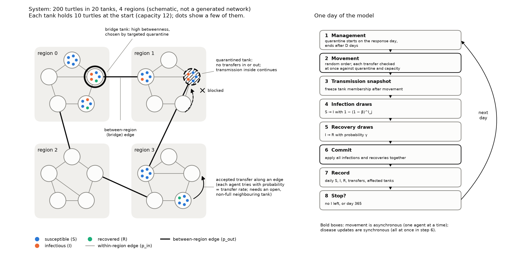

# Bridge Transfers and Quarantine in a Captive Turtle Farm

A CITS4403 agent-based modelling project by Cam Zhou (`camzhou831-star`) and Wenhao Zhang (`Winston-2hang`).

This repository contains the model, synthetic experiment inputs, recorded results, analysis and an executable notebook. The written report is submitted separately through the university website; report drafts and checkpoint speaking notes are not part of this code submission.

The model is **stylised and explanatory**. It is not calibrated to a real pathogen or farm, and uses no real turtle or customer data.

## Research questions

> How do cross-tank transfer rate and response delay affect the final outbreak size and the number of affected tanks in a modular captive-turtle housing system?

> Under the same intervention budget, does quarantining high-betweenness tanks reduce disease spread more effectively than quarantining randomly selected tanks?

Two hundred synthetic turtles occupy 20 tanks in four regions. Each turtle has a susceptible, infected or recovered state. Transfers follow a fixed modular network. Quarantine closes selected tanks to incoming and outgoing transfers, while infection and recovery inside those tanks continue.

The daily order is movement, an infection/recovery snapshot, simultaneous disease updates, and recording. A newly infected turtle cannot transmit or recover on that same day. Recovered turtles remain immune for the simulated outbreak. These are modelling assumptions, not claims about an identified turtle disease.



See [model rules and assumptions](data/methods/model.md) and the [result schema](data/methods/result-schema.md).

## Results and scope

The original **formal-nested** experiment contains 5,200 runs across 20 networks and 100 nested epidemic seeds. All runs completed without failure or censoring.

- Increasing transfers from 0.01 to 0.025 shifts many outbreaks from remaining in one region to spreading across regions.
- Closing two tanks for 14 days has a modest effect in this setting. Targeted quarantine does not consistently outperform random quarantine: only one of the nine non-zero-transfer attack-rate comparisons has a pointwise interval excluding zero.
- Paired delay contrasts do not establish a universal ordering of earlier and later intervention.

A separate **19,000-run follow-up** varies quarantine duration (7, 14 or 28 days) and samples 20 random-policy draws per network, at transfer rate 0.025. All runs completed, and all 400 replayed original conditions matched the recorded scientific fields.

Longer quarantine reduces mean attack rate in the tested comparisons, but also increases cost from 14 to 56 tank-days. Targeted-minus-random attack rate is −6.12 percentage points at duration 28 and delay 12, with a pointwise 95% interval of [−10.32, −1.68]. This is a conditional, exploratory result, not a general ranking of the strategies.

The follow-up reuses the original networks and epidemic blocks; it is not independent confirmation. Its contrasts are correlated and are not adjusted for multiple comparisons. Twenty random-policy draws do not guarantee 20 distinct tank pairs or complete policy-sampling convergence.

The [notebook](notebooks/project-walkthrough.ipynb) shows the calculations, figures and limitations. [Follow-up methods and findings](data/methods/followup.md) distinguish these results from the original experiment.

## Repository structure

```text
src/
  turtlefarm/                  model, network, runners and analysis
  tests/                       model, runner and analysis tests
  pytest.ini                   test discovery and import paths
utils/                         command-line tools and shared helpers
data/
  config/                      fixed experiment designs and seeds
  results/                     summaries, figures and supporting outputs
  figures/                     conceptual model diagram
  methods/                     model specification, protocols and validation
notebooks/
  project-walkthrough.ipynb     executed model walkthrough and analysis
requirements.txt               pinned Python dependencies, including notebooks
README.md                      setup, usage and project overview
```

The hidden `.gitignore` excludes environments, caches and regenerable raw records. Historical crossed-seed results remain under `data/results/analysis/formal/` and `data/results/summary/formal.csv`; they are not the final formal dataset. See [data and provenance](data/README.md).

## Setup

Use Python 3.12. Run the following from the repository root:

```bash
uv venv --python 3.12 .venv
source .venv/bin/activate
uv pip install -r requirements.txt

# Alternatively:
# python3.12 -m venv .venv
# source .venv/bin/activate
# python -m pip install -r requirements.txt

python -m pytest -c src/pytest.ini -q
```

Scripts locate the repository and add `src/` to their import path; no package installation is required. Use the explicit pytest configuration above, including when setting up an editor's test runner.

Git is required for experiment provenance. Optional MP4/GIF export also needs `ffmpeg` on PATH; viewing the existing figures and running the model, tests and notebook do not require it.

## Open the notebook

```bash
python -m jupyterlab notebooks/project-walkthrough.ipynb
```

In VS Code, open the same file, select the project's `.venv` interpreter and choose **Restart Kernel and Run All**.

The notebook runs small example simulations and recalculates statistics from the committed result tables. It does not run either full experiment batch or overwrite the recorded data. To check it without changing the saved notebook:

```bash
python -m jupyter nbconvert --execute --to notebook \
  --ExecutePreprocessor.timeout=180 \
  --output-dir=data/results/tmp/notebook-check \
  notebooks/project-walkthrough.ipynb
```

## Reproduce the experiments

The designs contain all parameter values and seeds. Run summaries, pilot criteria and analysis outputs are committed; the larger raw JSONL records are regenerable and ignored by Git.

```bash
# Pilot and parameter selection
python utils/run_experiment.py data/config/pilot-stage1-disease.json
python utils/run_experiment.py data/config/pilot-stage1-disease-r2.json
python utils/pilot_select.py stage1 --design pilot-stage1-disease-r2 --force
python utils/run_experiment.py data/config/pilot-stage2-intervention.json
python utils/pilot_select.py stage2

# Original final experiment and analysis
python utils/run_experiment.py data/config/formal-nested.json
python utils/analyse_results.py formal-nested
python utils/mechanism_analysis.py

# Separate duration and policy follow-up
python utils/run_followup.py data/config/followup-duration-policy.json --dry-run
python utils/run_followup.py data/config/followup-duration-policy.json --workers 4
python utils/analyse_followup.py
```

The Stage 1 selection command rewrites the Stage 2 configuration; `--force` explicitly permits that overwrite. Reproducing the same selection should leave the committed configuration unchanged.

Both runners refuse to overwrite an existing raw file. Add `--resume` to continue an existing batch; recorded failures are retained, not retried. The cumulative failure guard stops a halted design before appending more records. Investigate any failure and use a separately named output for a corrected rerun.

The follow-up runner also checks protocol/schema versions, a single implementation commit and duplicate or altered configurations. Its exclusive `<raw>.lock` marker prevents overlapping coordinators. After a crash, inspect the recorded PID and hostname before removing only a stale lock. Never remove an active lock or the raw data to force a resume.

To reproduce the follow-up without touching committed outputs:

```bash
python utils/run_followup.py data/config/followup-duration-policy.json \
  --workers 4 --output-dir data/results/tmp/followup-reproduction
python utils/analyse_followup.py \
  --followup data/results/tmp/followup-reproduction/summary/followup-duration-policy.csv \
  --output data/results/tmp/followup-reproduction/analysis/followup-duration-policy
```

Fresh runs record the current implementation commit. Historical receipts retain the original paths and hashes; moving files does not turn a historical result into a newly executed one. Use a fresh output directory when reproducing with a different implementation revision rather than resuming old raw records.

## Verification and supporting tools

```bash
python -m pytest -c src/pytest.ini -q
python utils/demo_final.py
python utils/audit_network.py --help
```

Tests cover conservation of agents, capacity, update order, hand calculations, paired randomness, movement, quarantine, extreme cases, batch resumption, analysis and follow-up observations. The demonstration reruns one paired block against stored results; a single block is not evidence for a general strategy ranking.

Optional presentation assets are generated with `python utils/make_presentation_assets.py` and `python utils/make_demo_video.py`. The saved three-minute video is a historical overview of the original experiment, not the completed follow-up. Use the notebook for the current results. Regenerate the conceptual diagram with `python utils/draw_concept_diagram.py`.

## Methods and limitations

| Reference | Contents |
|---|---|
| [Model](data/methods/model.md) | Research questions, state variables, daily rules and assumptions |
| [Experiments](data/methods/experiments.md) | Paired design, pilot criteria, selected parameters and run counts |
| [Validation](data/methods/validation.md) | Hand trace, invariants, network audits and reproduction evidence |
| [Decisions](data/methods/decisions.md) | Parameter decisions, protocol deviations and post-hoc analysis choices |
| [Follow-up](data/methods/followup.md) | Separate protocol, results, uncertainty and unresolved questions |
| [Result schema](data/methods/result-schema.md) | Original raw-record contract and follow-up event definitions |

Important limitations include the uncalibrated disease assumptions, one modular network family and a limited intervention budget. Quarantine blocking counters attribute an attempt to the first applicable rule; they do not measure how many additional successful transfers were prevented. Follow-up event observations do not identify infectors or transmission generations.

The pilot preceded one member's protocol sign-off; the transfer grid and Q1 denominator changed after initial data were seen. Cause-specific counters were subsequently specified and the Stage 2 pilot rerun. The first crossed-seed formal experiment was replaced by the nested design. The expanded network audit occurred after the formal experiment and found one rank-2 centrality tie. These deviations and the distinction between retrospective confirmations and outstanding approvals remain in the methods records.

## Contributions and acknowledgements

Cam Zhou developed the initial research design, baseline model, network generator, batch experiments, pilot selection and original analyses. Wenhao Zhang contributed movement and quarantine implementation, result metadata, validation and review, the executable notebook, follow-up work and repository maintenance. GitHub commits, issues and pull requests retain the detailed contribution and review history. Removing the weekly table does not assert that an unrecorded meeting or review took place.

The earlier `turtle-farm` project supplied domain inspiration only. This is a new model and synthetic experiment, not reused CITS4403 Lab Notebook code or assessed work from other units. Literature informs the modelling choices; the synthetic results are not empirical evidence about turtle farms.

Claude/Claude Code assisted Member A with implementation and writing. Codex assisted Member B with implementation, testing, analysis, documentation and reviews, as well as earlier read-only acceptance checks. AI assistance is not evidence of either member's independent understanding or of a completed human review; the authors remain responsible for the submitted work.
