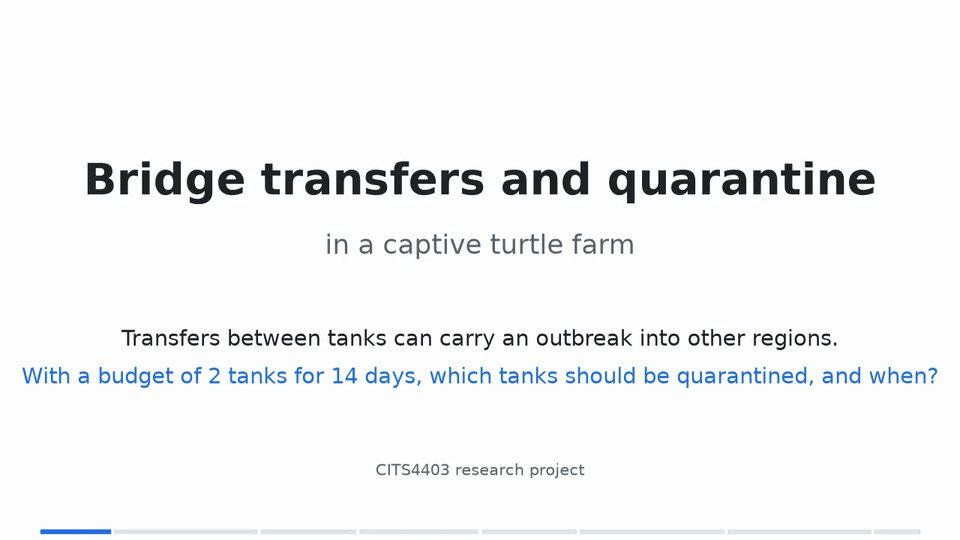

# Week 12 backup video

Video: [`demo-3min.mp4`](../results/demo/demo-3min.mp4) (3:00, 1280×720, silent). It is kept as a backup for the live presentation. Regenerate it with `python scripts/make_demo_video.py` (about 1 min, needs `ffmpeg`).

The video runs `pytest` and `scripts/demo_final.py` while it renders and shows their real output. The pilot table comes from `results/pilot/stage2-criteria.csv`. The headline numbers come from `report/report.md`, and the script stops if the report no longer states them.

## Role in the demonstration

The Week 12 demonstration is a live presentation with a slide deck, given by both members (`docs/demo-plan.md`). This video is a **backup**: if the live run or the deck fails, play it and speak over it, following the run of show in `docs/demo-plan.md`. Its animation also appears on its own in the deck as `results/demo/example-block.gif` (`scripts/make_presentation_assets.py`).

The earlier single-speaker script for this video was replaced by the speaker notes in the deck.
