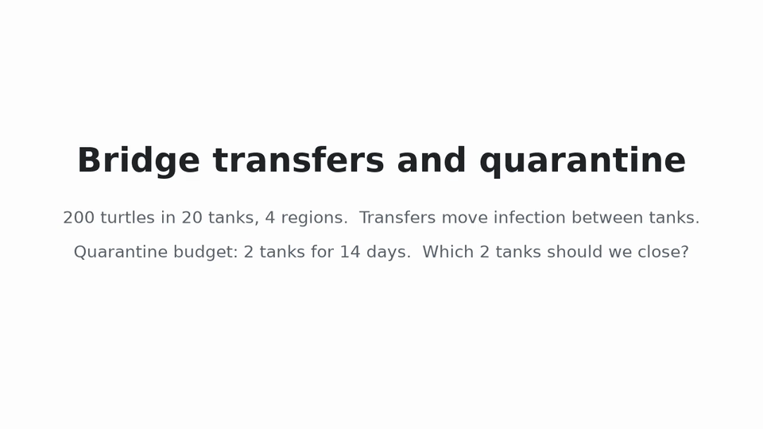

# Week 12 demo video (30 s)

Files: [`demo-30s.mp4`](../results/demo/demo-30s.mp4) (1280×720, silent, for narration) and [`demo-30s.gif`](../results/demo/demo-30s.gif). Regenerate with `python scripts/make_demo_video.py` (about 20 s, needs `ffmpeg`).

## What it shows

One paired block of `formal-nested`, the same one `scripts/demo_final.py` reruns: network 211, epidemic seed 20059, transfer rate 0.025, response delay 33 days. The block was picked by a rule on the no-intervention run only (figure 7). The random arm shown is the policy seed with the median attack rate of the three random arms (seed 1000), not the worst one.

| Arm | Attack rate | Tanks hit |
|---|---|---|
| No quarantine | 0.610 | 11 |
| Targeted (tanks 9, 19) | 0.475 | 9 |
| Random (tanks 3, 10) | 0.670 | 13 |

The closing card gives the formal results from the report (Conclusion and §3.4). This block favours targeting much more than the average; the narration says so.

## Narration (about 80 words)

| Time | Screen | Say |
|---|---|---|
| 0-3 s | Title | Two hundred turtles live in twenty tanks, and transfers carry infection between them. |
| 3-13 s | Days 0-58; quarantine appears on day 33 (at about 9 s) | Here is one outbreak, run three times with identical random draws. On day thirty-three we close two tanks for fourteen days: either the best-connected tanks, or two at random. |
| 13-23 s | Days 58-115 | In this run, closing the bridge tanks cut the attack rate from sixty-one to forty-seven percent. Random closure did not help. |
| 23-30 s | Results card | But over a hundred blocks per condition, targeting showed no consistent advantage. The transfer rate mattered far more. |
