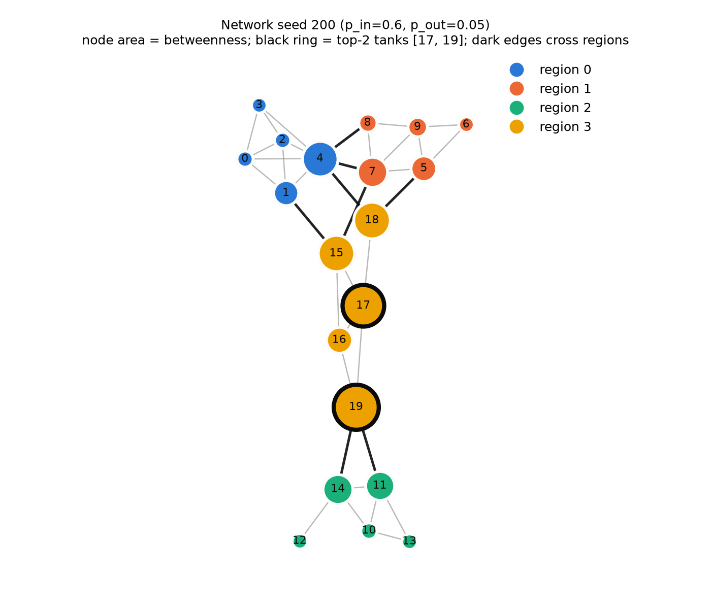
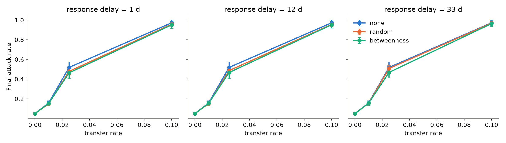
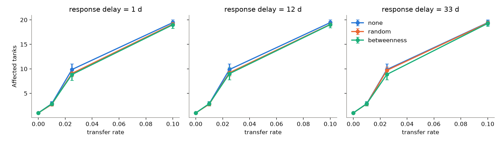
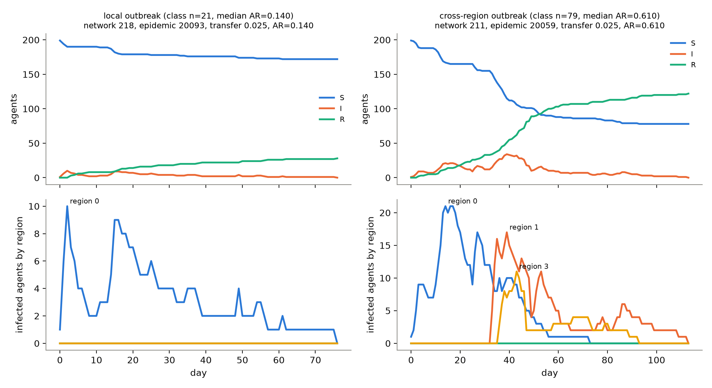
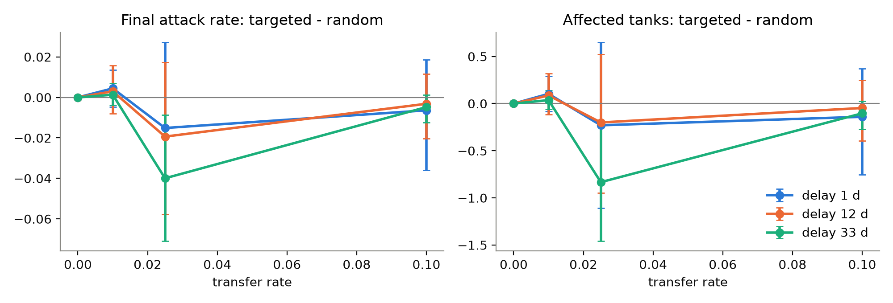

<!-- GENERATED by scripts/build_report.py from report/report.template.md; edit the template, not this file. -->

# Bridge Transfers and Quarantine in a Captive Turtle Farm

*CITS4403 Research Project. Draft for team review.*

## 1. Introduction

Moving animals between housing units is a routine part of captive husbandry. It is also a pathway for infection. In livestock systems, recorded animal movements have been linked to the spread of bovine tuberculosis [1], and the structure of the movement network shapes how pathogens can spread [2].

A facility made of many tanks has the same basic structure as a **metapopulation**: transmission is local within each unit, and units are connected by occasional transfers. In metapopulation models, an infection reaches a large share of subpopulations only when mobility exceeds an invasion threshold [3]. The structure of the contact network shapes how an epidemic spreads [4]. In networks with strong community structure, the few links between communities strongly affect whether a local outbreak becomes a global one [5].

This structure raises a practical question for anyone who can restrict movement. Suppose only a few tanks can be closed. Does it matter *which* tanks they are? Targeting the network position of nodes is far more effective than uniform random action in heterogeneous networks [6]. Network measures have also been used to identify individuals at high risk of infection [7]. In networks with strong community structure, interventions aimed at individuals that bridge communities outperform those aimed at highly connected individuals [5]. Betweenness centrality [8], the fraction of shortest paths passing through a node, is a natural pre-outbreak measure of such bridging.

We study these ideas in a deliberately simple system: 200 synthetic turtles in 20 tanks, grouped into 4 regions of a modular transfer network. Disease spreads within tanks, and turtles are occasionally moved along network edges. We ask two questions:

- **Primary.** How do the cross-tank transfer rate and the response delay affect the final outbreak size and the number of affected tanks?
- **Secondary.** Under the same intervention budget, does quarantining the highest-betweenness tanks reduce spread more than quarantining randomly chosen tanks?

We tested three hypotheses, fixed before the experiment:

- **H1.** A low but non-zero transfer rate lets a local outbreak spread between regions, raising the attack rate and the number of affected tanks.
- **H2.** A longer response delay does not lower the attack rate or the number of affected tanks.
- **H3.** Under an equal budget, highest-betweenness quarantine lowers both outcomes more than random quarantine.

The contribution is a controlled computational experiment, not a new simulator. Three design choices make the comparison clean:

- **Common random numbers.** Every strategy within a comparison block sees identical randomness, through event-keyed random draws [9].
- **Pre-registered parameter selection.** The criteria for choosing parameters were written down before the pilot data were seen.
- **Cluster-level uncertainty.** Confidence intervals resample whole network instances.

We report the deviations from our own protocol and their effect on the results. The model is a stylised explanation of mechanism, not a forecast for any real facility.

## 2. Methods

### 2.1 Model overview

We built a discrete-time stochastic agent-based model (ABM) of disease spread in a synthetic captive-turtle housing system. It is a **stylised explanatory model**: it is meant to show how transfer rate, response delay and the choice of quarantined tanks interact. It does not predict any real turtle disease, and all data are synthetic. One time step is one day.

The model has two layers:

- **Agent layer.** 200 turtle agents. Each has a disease state `S`, `I` or `R` and is housed in exactly one tank.
- **Tank layer.** 20 tanks with a fixed capacity of 12 agents. Each tank has a management state, `open` or `quarantined`.

Initially every tank holds 10 agents and one agent, chosen uniformly at random, is infected.

### 2.2 Transfer network

Tanks are the nodes of a static, undirected **modular transfer network**; an edge means agents may be moved directly between the two tanks. The 20 tanks form 4 regions of 5 tanks each. Each within-region pair is joined with probability `p_in` = 0.6 and each between-region pair with `p_out` = 0.05, so regions are internally dense and joined by a few bridge edges.

A generated network is accepted only if it:

1. is connected;
2. has at least one between-region edge;
3. is not a complete graph;
4. does not give every node the same betweenness.

A rejected attempt is redrawn deterministically from the same network seed, and every rejection is recorded.

Across the 20 networks of the formal experiment:

| Property | Median | Range |
|---|---|---|
| Modularity of the region partition [10] | 0.51 | 0.31–0.61 |
| Between-region edges | 8 | 5–15 |
| Mean degree | 3.30 | 2.70–4.00 |
| Diameter | 6 | 4–9 |

3 networks needed at least one redraw. Figure 1 shows one instance.



*Figure 1. Transfer network for network seed 200. Colour marks the region and node area is proportional to betweenness centrality. Dark edges join different regions. The black rings mark the two tanks the highest-betweenness strategy quarantines (tanks 19 and 17).*

### 2.3 Daily update

Each day runs these steps in a fixed order:

1. **Management.** Quarantine starts or ends.
2. **Movement.** Each agent attempts a transfer with probability `transfer_rate`. Attempts are processed in a random order, and each is checked at once against the current tank states. A transfer is blocked if the origin tank is quarantined or if no neighbouring tank is both open and below capacity. Otherwise the agent moves to an eligible neighbour chosen uniformly at random. Disease state does not affect movement.
3. **Transmission.** Mixing within a tank is complete. A susceptible agent in tank *j* becomes infected with probability `1 − (1 − beta)^I_j`, where `I_j` is the number of infectious agents in tank *j* after movement.
4. **Recovery.** Each agent that was infectious at the start of the day recovers with probability `gamma`. Recovered agents stay immune for the rest of the run.
5. **Commit.** Infections and recoveries are applied together, so a newly infected agent neither transmits nor recovers on the day it is infected.

A run stops on the first day with no infectious agents, or at a 365-day horizon; a run that reaches the horizon is recorded as censored.

### 2.4 Interventions and budget fairness

We compare three strategies:

- **No intervention.**
- **Random quarantine.** Choose *k* tanks uniformly at random. Only the policy seed drives this choice.
- **Highest-betweenness quarantine.** Choose the *k* tanks with the highest normalised betweenness [8] in the pre-outbreak network (computed with networkx, which implements Brandes' algorithm [11]), breaking exact ties by tank id.

Neither selector can see infection state or future movements. Both interventions quarantine *k* = 2 tanks, starting on the same response day and lasting *D* = 14 days, so each costs *k* × *D* = 28 tank-days. The only difference between them is which tanks are chosen.

A quarantined tank cannot send or receive transfers, but transmission and recovery inside it continue. The response delay is measured from the introduction of infection on day 0. It stands in for detection plus administrative response; the model has no explicit detection process.

### 2.5 Randomness and pairing

Each run is driven by three seeds:

- a **network seed**, which fixes the network instance;
- an **epidemic seed**, which fixes the initial infection and every movement, transmission and recovery draw;
- a **policy seed**, which fixes the random strategy's choice of tanks.

Epidemic draws are *event-keyed*, an implementation of common random numbers [9]: the uniform number used for any (process, day, agent) event depends only on the epidemic seed and that key. As a result, every strategy in a comparison block experiences exactly the same randomness. Their trajectories are identical until the quarantine starts, so any later difference comes from the intervention itself.

### 2.6 Verification

The test suite has 171 automated tests, covering:

- the invariants: agent count, `S + I + R = 200`, one tank per agent, capacity, no reinfection, quarantine blocking both directions, and reproducibility under identical seeds;
- extreme cases, for example `beta = 0`, `gamma = 1`, `transfer_rate = 0` and a full tank;
- the half-open quarantine interval and deterministic tie-breaking;
- a 3-tank, 6-agent scenario traced by hand by both team members and matched against the model's event log.

The invariants are also checked at runtime on every day of every run, and any violation ends the run as `failed`. No pilot or formal run failed.

### 2.7 Parameter selection (pilot)

`beta`, `gamma`, the transfer-rate levels, the response-delay levels and *D* were chosen in a two-stage pilot. Its selection criteria were committed to the repository before the pilot ran, and the pilot seeds were excluded from the formal experiment. The pilot never compared random with targeted quarantine.

**Stage 1** used no-intervention runs only. It required, among other things, that:

- with `transfer_rate = 0` the infection never leaves the first tank;
- the higher transfer levels do not consist almost entirely of minor outbreaks;
- the lowest level does not saturate;
- three non-zero levels differ by at least a factor of two in accepted transfers per day.

In the first round (2,000 runs) none of the 8 `(beta, gamma)` candidates met the last criterion. The grid's adjacent levels differ by a nominal factor of exactly 2, and capacity blocking pulled the realised ratio below 2. As the protocol requires, we kept the threshold and reran the whole stage (2,400 runs) on an extended grid. The added level, 0.025, was chosen by one member after seeing the first round's transfer volumes; the protocol also requires both members to confirm a new grid, and this confirmation was still pending. 7 candidates then passed. The pre-registered selection rule picks the candidate whose median attack rate at the middle transfer level is closest to 0.5; it chose `beta` = 0.2 and `gamma` = 0.1 (mean infectious period 10 days), with transfer levels 0, 0.01, 0.025, 0.1.

The three response delays are 1 (immediate), the median day on which infection first reaches a second tank, and the median time to peak. They were computed from 40 non-minor outbreaks and gave delays of 1, 12, 33 days. The pilot used the crossed seed design described in Section 2.8 (10 epidemic seeds shared by 5 networks), so these quantities rest on only 10 independent outbreak origins.

**Stage 2** considered *D* = 7, 14 and 21 days. The intended acceptance criteria were:

- **Q1:** the quarantine blocks at least one transfer in ≥ 90% of runs;
- **Q2:** *D* ≤ 25% of the median time to extinction;
- **Q3:** *D* ≥ the mean infectious period.

Using the whole-run blocked-transfer counter, the original all-runs proxy was 85.3%, below the 90% threshold. After inspecting the data, the denominator was changed to runs whose quarantine started, giving 97.4%. However, review found that this counter also includes capacity blocking and events outside the quarantine interval. Neither percentage verifies quarantine-specific Q1, and even a run whose quarantine never starts can contain blocked transfers.

*D* = 14 is the only tested candidate satisfying Q2 (*D* ≤ 16.25) and Q3. It was used in the completed formal experiment and is retained as that experiment's setting, not as a fully validated Q1-Q3 selection. The selector now reports Q1 as unverified and refuses automatic selection. Both historical proxy results and this post-hoc correction are preserved in the decision log. Establishing quarantine-specific blocking remains future validation work; no formal parameters or outcomes were changed by this correction.

### 2.8 Formal experiment

The factors were:

- transfer rate (0, 0.01, 0.025, 0.1);
- response delay (1, 12, 33 days);
- strategy (none, random, betweenness).

We used 20 network instances, each with 5 epidemic seeds of its own, for 100 distinct epidemic seeds in total. Each (network, epidemic seed, transfer rate) combination forms one paired block, giving 100 blocks per transfer rate. A block contains 13 runs:

- one no-intervention baseline, shared by all delays because the delay has no effect without an intervention;
- for each delay, one betweenness run and 3 random runs, one per policy seed.

This gives 5,200 runs in total.

A first formal run reused the same 5 epidemic seeds in every network, so the networks were crossed with the seeds instead of having seeds nested within them. Because draws are event-keyed, this gave every network the same initial infected agent and the same random draws. Outcomes were therefore strongly correlated across networks, leaving only 5 independent outbreak origins. For example, whether an outbreak died out early depended on the seed rather than on the network. The intended design (experiment plan §5) nests epidemic seeds within networks. We found the problem after viewing that run's results, reran with nested seeds, and report the nested run. The crossed run is kept, and Section 3.5 compares the two.

### 2.9 Analysis

The co-primary outcomes are:

- the **final attack rate**, the share of the 200 agents ever infected;
- the number of **affected tanks**, the tanks that ever held an infectious agent.

Peak infected count and time to extinction are secondary.

For each block we take the difference *targeted − random*, averaging the random arm over its policy seeds; a negative value favours targeted quarantine. We report the mean difference and a **relative reduction**, defined as −mean(difference) / mean(random arm). Confidence intervals (95%) come from a percentile bootstrap that resamples whole network instances (2000 resamples), so blocks that share a network are not treated as independent.

The same method gives each strategy's difference from its block's baseline. This comparison is descriptive: we added it after seeing the formal results, to show how the effect of each strategy changes with the response delay. We also report the targeted − random difference restricted to blocks in which the quarantine actually started. All numbers in this report are rendered from the result files by `scripts/build_report.py`.

## 3. Results

### 3.1 Run status

All 5,200 formal runs completed (failed: 0; censored at the 365-day horizon: 0). The quarantine never started in 0.0%, 2.0% and 12.0% of the non-zero-transfer blocks at delays of 1, 12 and 33 days, because the outbreak had already died out. In those blocks all three strategies are identical by construction.

### 3.2 Transfer rate drives the spread across regions

Without intervention, the transfer rate determines whether an outbreak stays in its first tank or spreads through the system (Table 1; Figures 2–3):

- **Transfer rate 0.** Infection never leaves the initial tank: the mean attack rate is 0.049, an average of 9.8 of the 10 agents in that tank.
- **Transfer rate 0.01.** The mean attack rate is 0.156 and 2.89 tanks are affected.
- **Transfer rate 0.025.** The mean attack rate is 0.519 and 9.86 tanks are affected.
- **Transfer rate 0.1.** The outbreak saturates the system: the attack rate is 0.972 and 19.44 of the 20 tanks are affected.

The epidemic lasts longest at the intermediate rate, with a median time to extinction of 90 days at 0.025 against 73.5 days at 0.1. At the intermediate rate, infection moves slowly from region to region; at the highest rate it reaches every region quickly and burns out sooner.

*Table 1. No-intervention outcomes by transfer rate (100 runs each; 95% CIs from a bootstrap that resamples whole networks).*

| Transfer rate | Final attack rate, mean [95% CI] | Affected tanks, mean [95% CI] | Peak infected, mean | Time to extinction, median (days) |
|---|---|---|---|---|
| 0 | 0.049 [0.048, 0.050] | 1.00 [1.00, 1.00] | 8.59 | 27 |
| 0.01 | 0.156 [0.139, 0.174] | 2.89 [2.55, 3.23] | 14.94 | 49 |
| 0.025 | 0.519 [0.464, 0.567] | 9.86 [8.78, 10.84] | 29.71 | 90 |
| 0.1 | 0.972 [0.941, 0.999] | 19.44 [18.86, 19.97] | 85.61 | 73.5 |



*Figure 2. Mean final attack rate (95% CI) by transfer rate and strategy, with one panel per response delay. The no-intervention baseline is the same in every panel.*



*Figure 3. Mean number of affected tanks, laid out as in Figure 2.*

Figure 7 contrasts the two kinds of outbreak at transfer rate 0.025. In 21% of the baseline runs at this rate, infection never left its initial region. The representative local outbreak (network 218, epidemic seed 20093) infects 0.14 of the population, all of it within one region. In the representative cross-region outbreak (network 211, epidemic seed 20059, attack rate 0.61), infection first peaks in its home region and only weeks later appears in two further regions, which then carry the second part of the epidemic.



*Figure 7. Representative runs at transfer rate 0.025 without intervention. Each was chosen as the run whose final attack rate is closest to the median of its class (local: 21 runs; cross-region: 79 runs), with ties broken by the smallest seeds. The rule was fixed before any individual trajectory was viewed. Top row: S/I/R counts. Bottom row: infectious agents in each region.*

### 3.3 Effect of quarantine and response delay

With a budget of 2 tanks for 14 days, both strategies reduce the attack rate only modestly (Table 2). The largest effects are at transfer rate 0.025.

- **Highest-betweenness quarantine** cuts the attack rate by a similar amount at every delay: 10.6%, 10.0% and 9.7% at delays of 1, 12 and 33 days.
- **Random quarantine** loses most of its effect as the delay grows: 7.7%, 6.3% and 2.0%.

At transfer rate 0.01 the reductions are at most a few per cent and, except for random quarantine at a 33-day delay (2.1% [0.4%, 4.5%]), cannot be distinguished from zero. At 0.1 the reductions are about 2% or less, because nearly every agent is infected anyway.

At transfer rate 0.025, then, the response delay matters for random quarantine but, within the 33 days studied, hardly at all for targeted quarantine. The intervals in Table 2 are wide and overlap across delays, so this pattern is a description, not a tested result.

*Table 2. Relative reduction in mean final attack rate compared with the block's own no-intervention baseline (descriptive; added after the formal results). † marks a mean-difference CI that includes 0.*

| Transfer rate | Delay (days) | Random: reduction in attack rate [95% CI] | Betweenness: reduction in attack rate [95% CI] |
|---|---|---|---|
| 0.01 | 1 | 5.3% [-0.6%, 10.5%]† | 2.4% [-5.2%, 9.4%]† |
| 0.01 | 12 | 3.7% [-0.6%, 8.8%]† | 1.8% [-3.9%, 7.6%]† |
| 0.01 | 33 | 2.1% [0.4%, 4.5%] | 1.3% [-1.6%, 4.4%]† |
| 0.025 | 1 | 7.7% [-0.6%, 14.6%]† | 10.6% [2.5%, 18.6%] |
| 0.025 | 12 | 6.3% [-1.1%, 13.2%]† | 10.0% [0.6%, 19.5%] |
| 0.025 | 33 | 2.0% [-3.5%, 7.6%]† | 9.7% [3.6%, 16.4%] |
| 0.1 | 1 | 1.5% [0.6%, 2.6%] | 2.2% [-0.0%, 5.2%]† |
| 0.1 | 12 | 1.7% [0.7%, 2.9%] | 2.0% [0.5%, 3.9%] |
| 0.1 | 33 | 0.3% [-0.1%, 0.7%]† | 0.8% [0.1%, 1.6%] |

### 3.4 Targeted versus random quarantine (secondary question)

Table 3 and Figure 4 give the paired targeted − random differences. Of the 18 cells with non-zero transfer (3 transfer rates × 3 delays × 2 outcomes), 2 have a 95% CI that excludes 0. Both are at transfer rate 0.025 with a 33-day delay:

- the mean paired difference in attack rate is -0.040 [-0.071, -0.009], a relative reduction of 7.9% [1.7%, 13.7%];
- the mean paired difference in affected tanks is -0.83 [-1.46, -0.20], a relative reduction of 8.6% [2.2%, 14.7%].

This is the cell in which random quarantine had lost most of its effect (Section 3.3). Even here the advantage is not consistent from block to block: targeted quarantine gives a lower attack rate in 52% of blocks, the same attack rate in 15% and a higher one in 33%. Restricting to the 93 blocks in which the quarantine started gives -0.043 [-0.078, -0.009].

In the other cells the intervals include 0. At transfer rate 0.01 the point estimates slightly favour random quarantine, for example 0.004 [-0.005, 0.014] at a 1-day delay, but this is not distinguishable from no difference.

*Table 3. Paired differences, targeted − random (negative favours targeted quarantine), with network-cluster bootstrap 95% CIs. The relative reduction is −mean(difference)/mean(random). † marks a CI that includes 0.*

| Transfer rate | Delay (days) | Attack rate: targeted − random [95% CI] | Relative reduction | Affected tanks: targeted − random [95% CI] | Relative reduction |
|---|---|---|---|---|---|
| 0.01 | 1 | 0.004 [-0.005, 0.014]† | -3.0% | 0.10 [-0.08, 0.29]† | -3.8% |
| 0.01 | 12 | 0.003 [-0.008, 0.016]† | -2.0% | 0.09 [-0.12, 0.32]† | -3.1% |
| 0.01 | 33 | 0.001 [-0.004, 0.007]† | -0.9% | 0.04 [-0.06, 0.14]† | -1.3% |
| 0.025 | 1 | -0.015 [-0.058, 0.027]† | 3.2% | -0.23 [-1.11, 0.65]† | 2.5% |
| 0.025 | 12 | -0.019 [-0.058, 0.017]† | 4.0% | -0.20 [-0.95, 0.52]† | 2.2% |
| 0.025 | 33 | -0.040 [-0.071, -0.009] | 7.9% | -0.83 [-1.46, -0.20] | 8.6% |
| 0.1 | 1 | -0.006 [-0.036, 0.019]† | 0.7% | -0.14 [-0.75, 0.37]† | 0.7% |
| 0.1 | 12 | -0.003 [-0.020, 0.012]† | 0.3% | -0.05 [-0.40, 0.25]† | 0.2% |
| 0.1 | 33 | -0.005 [-0.012, 0.001]† | 0.5% | -0.10 [-0.27, 0.03]† | 0.5% |



*Figure 4. Mean paired difference, targeted − random, with 95% cluster-bootstrap CIs.*

### 3.5 Sensitivity to the seed design

In the earlier crossed-seed run (5 epidemic seeds shared by every network), 7 of the 18 cells had a CI excluding 0, against 2 in the nested design. With only five shared outbreak origins, the networks behave like correlated rather than independent clusters, so the crossed run overstated its precision. The nested design is the one reported above.

## 4. Discussion

### 4.1 Hypotheses

**H1 is supported.** The no-intervention attack rate rises steeply with the transfer rate: 0.049, 0.156, 0.519 and 0.972 at rates 0, 0.01, 0.025 and 0.1. The number of affected tanks follows the same pattern. The steepest change falls between 0.01 and 0.025. Over this range, the share of outbreaks that reach a second region rises from 32% to 79%, so outbreaks switch from mostly staying within one region to mostly crossing regions (98% at 0.1). This is consistent with a mobility threshold for invading new subpopulations in metapopulation models [3]. We did not estimate the threshold itself, so we describe the pattern without claiming one was located.

**H2 is supported in direction but the effect is small.** Under each strategy and transfer rate, the mean attack rate does not fall as the delay grows, apart from one dip of under 0.01. At transfer rate 0.025, the mean attack rate under random quarantine rises from 0.479 to 0.508, while under targeted quarantine it is almost flat, from 0.464 to 0.468. The mean number of affected tanks shows a few similar small dips. Because the overall effect of a 2-tank, 14-day quarantine is modest, the room for the delay to matter is also small.

**H3 receives limited support.** Targeted quarantine has a lower point estimate than random quarantine in most cells with transfer rate 0.025 or 0.1. However, only the 0.025 rate with a 33-day delay has an interval excluding 0, and even there targeted quarantine is worse in a third of the blocks. At 0.01, the point estimates slightly favour random quarantine. The evidence therefore does not support the general claim that targeted quarantine is better under this budget. The data are consistent with a narrower, descriptive pattern: at an intermediate transfer rate, the effect of targeted quarantine did not decline with a later response, while that of random quarantine did. Testing this would need a pre-specified strategy × delay comparison.

### 4.2 A possible mechanism (not tested)

Why would random quarantine lose its effect with delay while targeted quarantine does not? We offer one explanation, which this experiment did not test.

A randomly chosen tank is a useful barrier only if the infection has not yet reached or passed it. As the outbreak grows, more randomly chosen tanks have already been infected or are far from the remaining susceptible regions, so closing them changes little.

A high-betweenness tank sits on many of the shortest paths between regions (Figure 1). It therefore stays relevant for as long as some region remains uninfected. In the representative cross-region run (Figure 7), regions were invaded weeks apart, so a quarantine on day 33 could still block a later invasion.

Testing this would require recording, for each quarantined tank, whether it was already infected at the response day and how many transfers it blocked between regions. Both can be derived from the existing raw records.

### 4.3 Limitations

- **Stylised system.** Turtles, tanks, the disease and the network are all synthetic. Nothing here is calibrated to a real pathogen or facility, and the magnitudes should not be read as predictions.
- **One budget.** We studied a single quarantine budget (2 tanks for 14 days) and a single disease regime (`beta` = 0.2, `gamma` = 0.1). Larger budgets, other durations, and the planned sensitivity analyses on `beta`, `gamma` and capacity were not run.
- **Simplified response.** The response delay counts from the introduction of infection, with no detection model. Quarantine blocks transfers only; transmission inside the tank continues, and movement does not depend on disease state.
- **Duration validation.** Q1 remains unverified because the blocked-transfer counter mixes capacity and quarantine effects over the entire run. Q2 and Q3 support the retained duration among the tested candidates, but do not establish that ≥ 90% of active quarantines prevent a transfer. Future validation must distinguish blocking causes during the active interval.
- **Statistical precision.** With 20 networks and 100 blocks per cell, the intervals are wide relative to the differences between strategies. Of the 18 targeted − random comparisons, we highlight the 2 that exclude 0. With no true difference, about one interval in twenty would exclude 0 by chance, so a single supportive cell among 18 correlated comparisons needs replication.
- **Post-hoc elements.** Several choices were made after data were seen and are flagged where they occur:
  - the Q1 denominator change and subsequent recognition that the mixed blocking counter cannot validate Q1;
  - the added transfer level;
  - the nested-seed rerun, and the crossed-versus-nested comparison;
  - the strategy-minus-baseline comparison;
  - the rule for choosing representative runs.

  Each is recorded in the decision log, and the original results are kept in the repository.
- **Partial sign-off.** The second team member had not yet signed off the pilot protocol when the pilot ran, nor confirmed the extended transfer grid. Both are recorded in the decision log.
- **Outbreak classes.** The local/cross-region classification uses end-of-day snapshots, so an infectious agent that arrives in a tank and recovers on the same day is not seen. This happened in 5 of 400 baseline runs. The 2 of them classed as local were rerun, and their affected tanks were all inside the initial region.

## 5. Conclusion

In a modular tank system, the transfer rate decides whether a local outbreak stays local. Moving from a transfer rate of 0.01 to 0.025 multiplies the attack rate by 3.3 and the number of affected tanks by 3.4.

A small quarantine budget of 2 tanks for 14 days reduces the attack rate by at most 10.6%. Across all conditions, we could not show that targeted quarantine beats random quarantine. At the intermediate transfer rate, the effect of targeted quarantine did not decline with a later response while that of random quarantine did; this is a descriptive pattern, not a tested result.

Within this model, the transfer rate changes outcomes far more than the choice of quarantined tanks does under this budget. We did not test whether reducing cross-region transfers would be a better use of resources than quarantine, because the transfer rate was an experimental factor, not an intervention with a cost.

All results can be regenerated from the repository:

```bash
python scripts/run_experiment.py experiments/config/formal-nested.json
python scripts/analyse_results.py formal-nested
python scripts/build_report.py
```

## References

[1] M. Gilbert, A. Mitchell, D. Bourn, J. Mawdsley, R. Clifton-Hadley and W. Wint, "Cattle movements and bovine tuberculosis in Great Britain," *Nature*, vol. 435, no. 7041, pp. 491–496, 2005. doi:10.1038/nature03548

[2] R. Kao, L. Danon, D. Green and I. Kiss, "Demographic structure and pathogen dynamics on the network of livestock movements in Great Britain," *Proceedings of the Royal Society B*, vol. 273, no. 1597, pp. 1999–2007, 2006. doi:10.1098/rspb.2006.3505

[3] V. Colizza and A. Vespignani, "Epidemic modeling in metapopulation systems with heterogeneous coupling pattern: Theory and simulations," *Journal of Theoretical Biology*, vol. 251, no. 3, pp. 450–467, 2008. doi:10.1016/j.jtbi.2007.11.028

[4] M. J. Keeling and K. T. Eames, "Networks and epidemic models," *Journal of the Royal Society Interface*, vol. 2, no. 4, pp. 295–307, 2005. doi:10.1098/rsif.2005.0051

[5] M. Salathé and J. H. Jones, "Dynamics and control of diseases in networks with community structure," *PLoS Computational Biology*, vol. 6, no. 4, e1000736, 2010. doi:10.1371/journal.pcbi.1000736

[6] R. Pastor-Satorras and A. Vespignani, "Immunization of complex networks," *Physical Review E*, vol. 65, no. 3, 036104, 2002. doi:10.1103/PhysRevE.65.036104

[7] R. M. Christley, G. L. Pinchbeck, R. G. Bowers, D. Clancy, N. P. French, R. Bennett and J. Turner, "Infection in social networks: Using network analysis to identify high-risk individuals," *American Journal of Epidemiology*, vol. 162, no. 10, pp. 1024–1031, 2005. doi:10.1093/aje/kwi308

[8] L. C. Freeman, "A set of measures of centrality based on betweenness," *Sociometry*, vol. 40, no. 1, pp. 35–41, 1977. doi:10.2307/3033543

[9] P. Glasserman and D. D. Yao, "Some guidelines and guarantees for common random numbers," *Management Science*, vol. 38, no. 6, pp. 884–908, 1992. doi:10.1287/mnsc.38.6.884

[10] M. E. J. Newman, "Modularity and community structure in networks," *Proceedings of the National Academy of Sciences*, vol. 103, no. 23, pp. 8577–8582, 2006. doi:10.1073/pnas.0601602103

[11] U. Brandes, "A faster algorithm for betweenness centrality," *Journal of Mathematical Sociology*, vol. 25, no. 2, pp. 163–177, 2001. doi:10.1080/0022250X.2001.9990249
